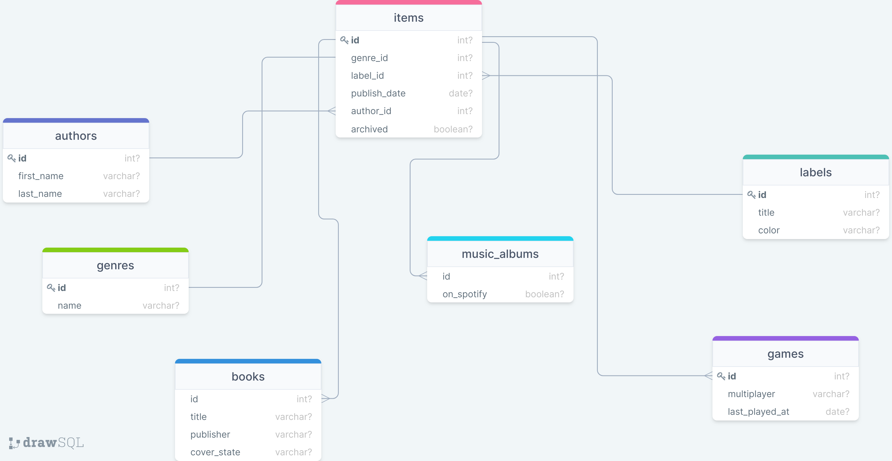

# Catalog

> A console app that will help you to keep a record of different types of things you won: books, music albums, movies, and games

[Wathc the Video Presentation](https://drive.google.com/file/d/14dQ0yfdjtAlM94y85INMtOCcvlXFt6xz/view?usp=sharing)



## Built With

- Ruby

## Getting Started

To get a local copy up and running follow these simple example steps.

## Prerequisites

- A text editor(preferably Visual Studio Code)

## Install

- Ruby

## Using it Locally

- Clone the project

- Clone the repo using the command below

```
git clone https://github.com/cwaku/Catalog.git
```

- Navigate to the directory in which you cloned the project and use the command below

```
cd Catalog
```

- Start the program using the commands below

```bash
open terminal
run the command $irb (interactive ruby shell)
run the files locally using the command ruby main.rb
```

## Authors

👤 **Affaxed Kiprotich**

- GitHub: [@DelhinRharl](https://github.com/DelhinRharl)
- Twitter: [@affaxed-kip](https://twitter.com/affaxed-kip)
- LinkedIn: [Affaxed Kiprotich](https://www.linkedin.com/in/affaxed-kiprotich/)

👤 **Ricky Mormor**

- GitHub: [@cwaku](https://github.com/cwaku)
- LinkedIn: [Ricky Mormor](www.linkedin.com/in/rickymormor)
- Instagram: [@rickymormor](https://instagram.com/rickymormor)
- Twitter: [@rickymormor](https://twitter.com/rickymormor)

👤 **Anuar Shaidenov**

- GitHub: [@anuarshaidenov](https://github.com/anuarshaidenov)
- Twitter: [@anuarnyi](https://twitter.com/anuarnyi)
- LinkedIn: [Anuar Shaidenov](https://www.linkedin.com/in/anuar-shaidenov-365a951b8/)

## 🤝 Contributing

Contributions, issues, and feature requests are welcome!

Feel free to check the [issues page](../../issues/).

## Show your support

Give a ⭐️ if you like this project!
